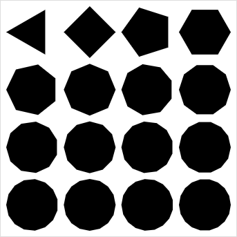

g.js
====
g.js is a JavaScript library for vector graphics.

    var i = 0;
    var paths = [];
    g.grid(4, 4, 250, 250).map(function (pt, i) {
        var p = g.ellipse(pt, 75, 75);
        return p.resampleByAmount(i + 3);
    });

Installation
------------

### Directly

[Download the latest ZIP](https://github.com/nodebox/g.js/archive/master.zip) and grab the files in the `dist` folder.
These are compiled.

### Using Bower

To install using [Bower](http://bower.io/), enter the following command in your project directory:

    bower install g.js

You can then include them in your scripts using:

    

### Using Browserify

To install using [Browserify](http://browserify.org/), enter the following command in your project directory:

    npm install --save g.js

Development
-----------
We use a set of [npm scripts](https://www.npmjs.org/doc/misc/npm-scripts.html) to build releases:

### During development

Running `npm run watchify` will automatically create new builds in the `build` directory whenever the source changes.

### Updating the dist

Running `npm run dist` will build a complete and minified version of g.js in the `dist` folder. You can also run
`npm run browserify` and `npm run uglify` separately.

### Publishing a release

1. Update the version number in `package.json` and `bower.json`.
2. Run `npm run dist` to update the files in the `dist` folder.
3. Commit (`git commit -a`) and create a tag (e.g. `git tag 1.2.1`). Push and push tags (`git push && git push --tags`).
4. Run `npm publish` to publish the package to npm. You don't have to do anything for Bower.

Credits
-------
g.js is based on [canvas.js](https://github.com/clips/pattern/blob/master/pattern/canvas.js) (BSD). De Smedt T. & Daelemans W. (2012). Pattern for Python. Journal of Machine Learning Research.

* Stefan Gabriëls <stefan@emrg.be>
* Frederik De Bleser <frederik@emrg.be>
